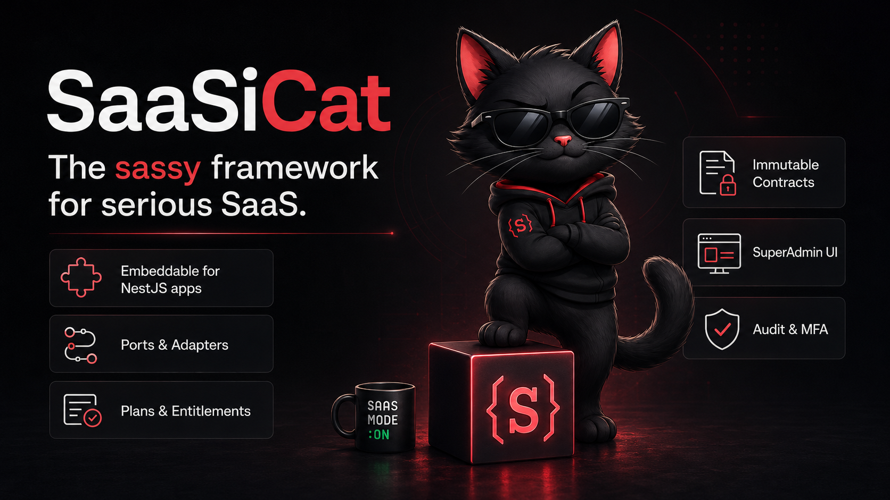

# SaaSiCat

**The sassy framework for serious SaaS.**



**SaaSiCat** is an embeddable SaaS platform framework for [NestJS](https://nestjs.com): plans & entitlements, bundles, promo codes, billing lifecycle, audit, MFA, first-run setup and a ready-to-use SuperAdmin UI.

> **Status: 0.x — early.**
> The API is **not yet stable** and may change between minor releases.
> SaaSiCat was extracted from a production system powering two commercial SaaS products — the code is battle-tested, the public packaging is new.

## What you get

- **Tenant administration** — list, inspect, suspend/reactivate, impersonate, export.
- **Plans & plan versions** — plan editor, drafts and publishing; a published plan version is an immutable snapshot.
- **Bundles & business types** — versioned product options that can be sold standalone or included in plans, with a marketing projection.
- **Discovery loop** — your code declares capabilities, features and quotas with decorators (`@ImplementsCapability`, `@DefinesQuota`); the platform scans them at boot, the SuperAdmin reviews them, and approved entries flow into the marketing catalog and plans.
- **Runtime entitlement enforcement** — `@RequireFeature(...)` answers with a structured 403 (`FEATURE_NOT_LICENSED`, optional upsell offers), `@EnforceQuota(...)` blocks requests that would exceed a plan limit.
- **Marketing catalog** — i18n labels, descriptions, highlights and promotions, served through a public `GET /public/catalog` endpoint for your pricing page.
- **Checkout offers & subscription contracts** — a frozen purchase intent becomes an immutable contract: the single source of truth for billing and entitlement. Catalog edits never touch running contracts.
- **Billing lifecycle hooks** — materialization, freeze and trial handling as optional platform ports.
- **Promo codes** — generation, lifecycle, redemption tracking.
- **Security building blocks** — TOTP MFA for SuperAdmin actions, audit logging of every sensitive operation, an RLS-bypass interceptor for global reads.
- **First-run setup** — a `SETUP_TOKEN`-gated wizard creates the first SuperAdmin (including MFA enrollment) and disables itself once one exists.
- **CLI flows** — `<app> admin mfa-setup|whoami`, `<app> audit tail`, `<app> doctor`, `<app> manifest dump|hash|validate|check`, ready to embed in your app's own nest-commander CLI.
- **SuperAdmin UI** — Vue 3 + Quasar standard pages (dashboard, tenants, plans, discovery, catalog, audit, …) that switch on and off dynamically via the admin manifest.

Your app keeps implementing what only it can know: persistence adapters, its own capabilities, quota counters and manifest contributions. Everything else comes from the packages.

## Packages

| Package | Purpose |
| --- | --- |
| `@saasicat/spec` | The language-neutral contract: OpenAPI, JSON Schemas, Prisma fragments, CLI conventions. |
| `@saasicat/types` | TypeScript types generated from the spec schemas. |
| `@saasicat/nest` | The backend core: NestJS modules, services, guards and decorators. |
| `@saasicat/adapter-prisma` | The Prisma + PostgreSQL persistence adapter: `prismaPersistence()` bundle plus individual adapters for every shipped port, targeting the canonical schema. |
| `@saasicat/adapter-drizzle` | The Drizzle + PostgreSQL persistence adapter: `drizzlePersistence()` bundle — same ports, same canonical schema, verified by the same contract. |
| `@saasicat/persistence-testing` | Executable persistence contract — the node:test suite every adapter must pass against a real database (locks, rollback, atomic promo claims, …). |
| `@saasicat/cli` | nest-commander command flows to embed in your application CLI. |
| `@saasicat/ui-vue` | Vue 3 + Quasar SuperAdmin pages, Pinia stores and composables. |
| `create-saasicat-admin` | Scaffolder — `pnpm create saasicat-admin` produces a ready-to-run admin frontend. |

All packages are released in lockstep and share one version number.

## Architecture in three lines

SaaSiCat is **embeddable, not hosted**: your application keeps its own database, auth and HTTP stack. The platform defines narrow **ports** (persistence, MFA, audit, RLS bypass, plan resolution) and you plug in **adapters** — for Prisma + PostgreSQL they ship ready-made. Discovery, catalog, entitlement, admin API and admin UI then come entirely from the packages.

## Reference implementation

[`examples/notesapp`](examples/notesapp/) is a small runnable NestJS app that
walks the quickstart end to end — plans from `saas.yaml`, `@DefinesQuota` +
`@RequireFeature`/`@EnforceQuota` enforcement (402/403 verified via curl),
the `prismaPersistence()` bundle and the admin manifest. Start there if you
prefer reading code over docs.

## Getting started

Add the backend packages to an existing multi-tenant NestJS app (Prisma + PostgreSQL + JWT auth):

```bash
pnpm add @saasicat/nest @saasicat/types @saasicat/spec \
         @saasicat/adapter-prisma @saasicat/cli
```

Scaffold the SuperAdmin frontend in one command:

```bash
pnpm create saasicat-admin admin --project-key=myapp --brand-name=MyApp
```

Then follow the **[quickstart](docs/quickstart.md)** — 10 steps from an existing CRUD backend to a working SuperAdmin with plan-based feature gates and quota enforcement, in about 30 minutes and under 100 lines of app-owned code. The [handbook](docs/handbook.md) is the in-depth reference behind it.

> **Note:** the Admin UI is currently German; English i18n is on the roadmap. The APIs, error codes and all documentation are English.

## Requirements

- Node.js ≥ 24, pnpm
- NestJS 11 backend; Prisma + PostgreSQL for the ready-made adapters (other stacks via custom port adapters)
- Vue 3 + Quasar + Vite for the admin frontend

## Contributing

Issues and pull requests are welcome at [github.com/uelker70/saasicat](https://github.com/uelker70/saasicat). Packages are published under the [@saasicat](https://www.npmjs.com/org/saasicat) scope on npm.

## License

[Apache-2.0](LICENSE)
